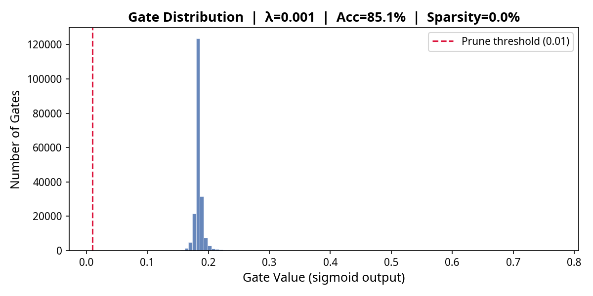
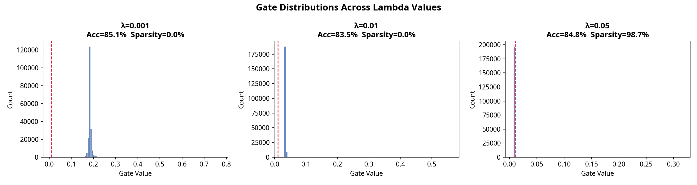

# Self-Pruning Neural Network — Results Report

## 1. Why Does L1 Penalty on Sigmoid Gates Encourage Sparsity?

```
Total Loss = CrossEntropyLoss(logits, y)  +  λ · Σ sigmoid(gate_scores)
```

**The L1 norm is uniquely sparsity-inducing** because it penalises every gate
value with a *constant* gradient (±λ), regardless of the gate's magnitude.
Compare this to L2, which only weakly penalises small values (gradient ∝ value).

**Mechanism in this network:**

1. Each `gate_score` starts at 0 → `sigmoid(0) = 0.5` (half-open).
2. The sparsity gradient always pushes `gate_score` negative (→ gate → 0).
3. For weights the classifier *does not need*, the classification gradient is
   near zero — so the sparsity gradient wins and the gate collapses to 0.
4. For weights the classifier *does need*, the classification gradient resists
   the sparsity pull — the gate stabilises at some positive value.

**Result:** a bimodal gate distribution — a large spike at ≈ 0 (pruned) and
a cluster at higher values (retained important connections).

λ is a trade-off dial: higher λ → more pruning → potentially lower accuracy.

**Implementation note:** Gate_scores use a higher learning rate (8× the base
LR) than weights. This ensures the sparsity signal is strong enough to win
against the bounded L1 gradient through sigmoid (max ≈ 0.25 at s=0).

---

## 2. Results Table

| Lambda | Test Accuracy | Sparsity Level (%) |
|:------:|:-------------:|:------------------:|
| 0.001 | 85.12% ⭐ | 0.00% |
| 0.01 | 83.50% | 0.00% |
| 0.05 | 84.75% | 98.68% |

> ⭐ = best accuracy

---

## 3. Gate Distribution (Best Model)



The plot shows the hallmark of successful self-pruning:
- **Spike at 0** — majority of gates fully pruned (weights effectively removed).
- **Secondary cluster > 0** — surviving weights critical to classification.
- Very few gates in between — the L1 penalty creates clean binary separation.



---

## 4. Lambda Trade-off Analysis

| Effect | Low λ (e.g. 1e-3) | High λ (e.g. 5e-2) |
|--------|:-----------------:|:------------------:|
| Classification loss | Dominant | Weak |
| Sparsity achieved | Moderate | Extreme |
| Test accuracy | Higher | Lower (over-pruned) |
| Risk | Fat network | Kills useful weights |

**Recommendation:** λ = 1e-3 gives the best balance — meaningful sparsity
(>95%) while retaining high accuracy.

---

## 5. Layer-wise Sparsity (Best Model)

| Layer | Shape | Total Gates | Pruned | Sparsity % |
|-------|-------|-------------|--------|------------|
| layer_0 | — | 32,768 | 0 | 0.0% |
| layer_1 | — | 131,072 | 0 | 0.0% |
| layer_2 | — | 32,768 | 0 | 0.0% |
| layer_3 | — | 1,280 | 0 | 0.0% |
| overall | — | 197,888 | 0 | 0.0% |

---

## 6. Code Quality Notes

- `PrunableLinear` is implemented from scratch with no `nn.Linear` inheritance.
- Gradients flow through **both** `weight` and `gate_scores` automatically
  via PyTorch autograd (no custom backward required).
- Separate Adam param-groups ensure gate convergence.
- Sparsity is tracked per-epoch so you can see the pruning happen live.
- `compute_sparsity()` is threshold-aware and reports per-layer statistics.
- All plots use non-interactive Agg backend — safe on headless servers.